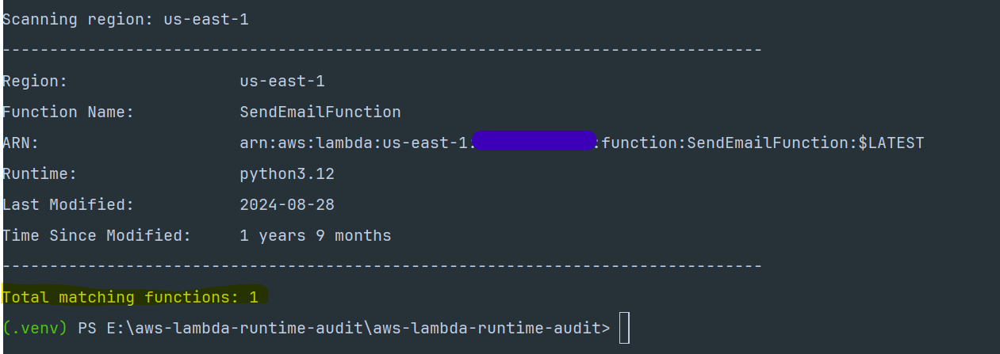
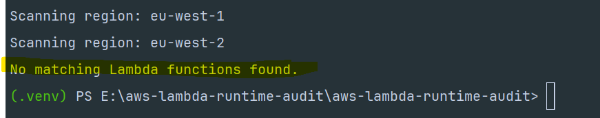

# 🔍 AWS Lambda Runtime Audit Tool

A Python-based AWS audit utility for identifying Lambda functions running specific runtimes across one or more AWS regions.

This project is designed for cloud, platform, and infrastructure engineers who need better visibility into Lambda runtime usage, runtime lifecycle risk, stale functions, and serverless platform governance.

The current example focuses on Python 3.10 runtime auditing, because Python 3.10 reaches end of life on 31 October 2026. Auditing workloads before runtime end-of-life helps teams plan safer upgrades, reduce operational risk, and avoid unsupported serverless deployments.

# 💻 Matching Lambda function found

### The example below shows the tool scanning a region and finding a Lambda function matching the selected runtime.



# 💻 No matching Lambda functions found

### The example below shows the tool scanning regions where no Lambda functions matched the selected runtime.



---

# 📄 Example Output

```text
--------------------------------------------------------------------------------
Region:                  eu-west-1
Function Name:           payments-api-prod
ARN:                     arn:aws:lambda:eu-west-1:123456789012:function:payments-api-prod
Runtime:                 python3.10
Last Modified:           2022-04-18
Time Since Modified:     2 years 4 months
--------------------------------------------------------------------------------

Total matching functions: 14
```

---

# Why This Exists

In real AWS environments, Lambda functions can grow quickly across teams, regions, and workloads.

Over time:

* runtimes approach end-of-life
* functions remain unchanged for long periods
* deprecated or unsupported runtimes stay deployed
* ownership becomes unclear
* upgrade planning becomes manual
* operational and security risk increases

Runtime lifecycle management becomes especially important when a language version is approaching end-of-life. For example, Python 3.10 reaches end of life on 31 October 2026, which makes it a good candidate for proactive audit and migration planning.

This tool helps identify Lambda functions running a selected runtime, such as python3.10, and provides useful operational metadata including function name, region, ARN, last modified date, and time since last modification.

The goal is not only to list functions, but to support safer runtime modernization, platform governance, and infrastructure review processes.

---

# What this tool does

The script scans AWS Lambda functions across one or more AWS regions and returns functions matching a selected runtime.

It can be used to:

* audit Lambda functions running runtimes approaching EOL
* prepare runtime migration projects
* identify stale serverless workloads
* support cloud governance reviews
* generate CSV reports for platform teams
* improve visibility across regional Lambda estates
* support infrastructure modernization work
* provide evidence for operational risk reviews

---

# Features

✓ Multi-region Lambda scanning

✓ Runtime filtering

✓ AWS API pagination using Boto3 paginators

✓ Function exclusion filters

✓ Human-readable last modified reporting

✓ CSV export support

✓ AWS API error handling

✓ Safe continuation when one region fails

✓ Lightweight Python implementation

---

# Architecture and flow

    Local machine / CI runner
              |
              |  AWS credentials
              v
    Python audit script
              |
              |  boto3 Lambda client
              v
    AWS Lambda ListFunctions API
              |
              v
    Runtime filtering and metadata extraction
              |
              +--> Terminal output
              |
              +--> Optional CSV report

----

# Example Use Cases

* Audit deprecated Lambda runtimes
* Prepare runtime migration projects
* Identify stale serverless workloads
* Improve cloud governance visibility
* Support platform engineering operations
* Generate reporting for infrastructure reviews

---

# Requirements

* Python 3.9+
* AWS credentials configured
* IAM permission to list Lambda functions
* Boto3

Install dependencies:
```bash
pip install -r requirements.txt
```

If installing manually:
```bash
pip install boto3 botocore
```
---

# AWS permissions required

The IAM identity used to run this script only needs read access to list Lambda functions.

Minimum IAM policy:


```json
{
	"Version": "2012-10-17",
	"Statement": [
		{
			"Effect": "Allow",
			"Action": [
				"lambda:ListFunctions"
			],
			"Resource": "*"
		}
	]
}
```

For local testing, use a personal AWS sandbox account or a dedicated low-permission IAM user.

---

# AWS Authentication

This script uses the standard Boto3 credential provider chain.

Supported authentication methods include:

* AWS CLI configured credentials
* environment variables
* named AWS profiles
* IAM role credentials when running on AWS infrastructure
* SSO-based credentials, if configured locally

Example using AWS CLI:

`aws configure`

You will be prompted for:

- AWS Access Key ID

 - AWS Secret Access Key

- Default region name

 - Default output format


Recommended default output format:

`json`

To confirm credentials are working:

`aws sts get-caller-identity`

---

# ▶️ Usage

## Basic Scan

```bash
python aws_lambda_runtime_audit.py
```

Default values:

* Region: eu-west-1 
* Runtime: python3.10 
* Exclude: custodian

---

## Scan a specific region

```bash
python aws_lambda_runtime_audit.py --regions us-east-1 --runtime python3.10
```

---

## Scan Multiple Regions

```bash
python aws_lambda_runtime_audit.py \ --regions eu-west-1 eu-west-2 us-east-1 \ --runtime python3.10
```

---

## Audit a specific runtime

```bash
python aws_lambda_runtime_audit.py --runtime python3.10
```

---

## Exclude function name patterns

Use `--exclude` to ignore functions where the name contains specific terms.

```bash
python aws_lambda_runtime_audit.py \ --regions us-east-1 \ --runtime python3.10 \ --exclude custodian monitoring test
```

---

## Export Results to CSV

Create the reports' folder:

```bash
`mkdir reports`
```
Run the with CSV export:

```bash
python aws_lambda_runtime_audit.py \ --regions us-east-1 \ --runtime python3.10 \ --csv reports/lambda_runtime_audit_python310.csv
```
The generated CSV should remain local and should not be committed if it contains real AWS account IDs, ARNs, or function names.

---

# ⚠️ Important Notes

* AWS Lambda runtimes periodically reach end-of-life
* Deprecated runtimes can introduce:

  * security risk
  * operational risk
  * unsupported deployments

Always review:

* AWS runtime support policies
* upgrade paths
* workload ownership before migration

---

# 🛠️ Potential Future Improvements

* AWS Organizations support
* Multi-account auditing
* Parallel region scanning
* Slack / Teams notifications
* CloudWatch metrics export
* Runtime age scoring
* Tagging compliance checks
* HTML reporting dashboard

---

# 🧠 Platform Engineering Perspective

This project reflects a common operational problem in real cloud environments:

> As serverless adoption grows, runtime visibility and governance become harder to manage manually.

A small automation tool like this can help platform teams:

* reduce manual discovery work
* identify runtime modernization scope
* support upgrade planning
* improve operational visibility
* reduce unsupported runtime risk
* strengthen platform governance
* provide reporting for infrastructure reviews

The value is not only in the script itself, but in the operating model it supports: visibility, ownership, lifecycle management, and safer platform change.

---

# 📚 Technology stack

* Python
* Boto3
* Botocore
* AWS Lambda
* AWS IAM
* AWS CLI
* CSV reporting

---

# Local development

Create a virtual environment:
```bash
python -m venv .venv
```
Activate it on Windows PowerShell:
```bash
.\.venv\Scripts\Activate.ps1
```
Activate it on macOS or Linux:
```bash
source .venv/bin/activate
```
Install dependencies:
```bash
pip install -r requirements.txt
```
Run the script:
```bash
python aws_lambda_runtime_audit.py --regions us-east-1 --runtime python3.12
```
Export to CSV:
```bash
mkdir reports
```
```bash
python aws_lambda_runtime_audit.py \
  --regions us-east-1 \
  --runtime python3.10 \
  --csv reports/lambda_runtime_audit.csv
```
Troubleshooting
Unable to locate credentials

Boto3 cannot find AWS credentials.

Fix:
```bash
aws configure
```
Then verify:
```bash
aws sts get-caller-identity
```
---

# 👤 Author

Built with ☕, curiosity, and systems thinking by Alex.

This project reflects a real infrastructure problem: identifying outdated or unmanaged Lambda runtimes before they become operational risk.


